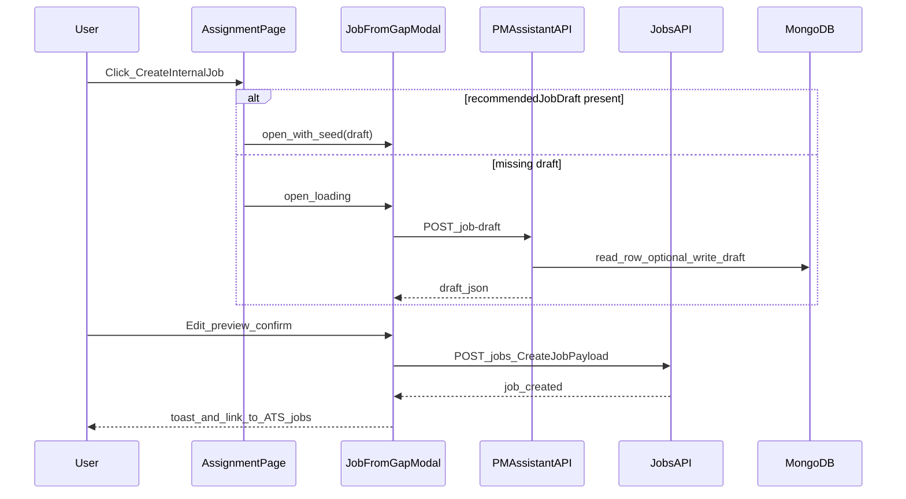

# feat: Gap row → internal ATS job (draft, preview, post)

**Target repos:** `uat.dharwin.frontend` (primary UX), `uat.dharwin.backend` (PM-assistant endpoint, optional persistence).

**Canonical handoff:** This file is the implementation source of truth. The Cursor plan `gap_row_job_to_ats` should stay in sync or link here.

---

## Plan: Gap row → internal ATS job

**Goal:** When assignment review shows a task with no suitable ATS match, the user can generate (or reuse) a structured job draft, review and edit it in a modal, and publish an **internal** ATS job via existing `POST /jobs` — with clear permissions, human-in-the-loop approval, and safe defaults (Draft, no fabricated org facts).

**Estimated timeline:** 2–4 engineering days (1 day backend route + service + validation; 1–1.5 days modal + assignment table integration + API client; 0.5–1 day QA, copy, edge cases, optional rate limit).

**Difficulty level:** Medium — crosses PM assistant, permissions (`projects.read` vs `jobs.manage`), LLM untrusted input, and job validation enums; low schema risk because `Job` already defaults `jobOrigin: internal` and `createJob` strips client `jobOrigin`.

---

## Research and key facts

**Internal mobility copy:** Internal postings perform best when framed as growth, responsibilities, qualifications, and a clear apply path — not only “we have an opening” ([Ongig internal job posting templates](https://blog.ongig.com/job-postings/internal-job-posting-template/); [HireEZ internal mobility practices](https://hireez.com/blog/internal-mobility-best-practices/)). For this feature, the modal should allow a short “Internal opportunity” intro line (editable) assembled from project/task context, not only raw `descriptionOutline`.

**Human-in-the-loop:** AI-assisted hiring content should pass an explicit human review gate before publish; governance playbooks emphasize inventory, review stages, and auditability ([Peopletech — AI governance for HR](https://peopletech.cloud/stop-cleaning-up-after-ai-governance-playbook-for-hr-and-ope); [JadeRank — AI content review workflows](https://jaderank.io/ai-content-review-and-approval-workflows/)). Default **Draft** status and an explicit “Post to ATS” / “Save as draft” affordance match that pattern.

**Regulatory posture (EU / global HR AI):** Recruitment AI is treated as **high-risk** in several jurisdictions; deployers benefit from transparency, logging, and avoiding fully automated “fire” decisions without meaningful oversight ([ClearAct — HR AI under EU AI Act](https://clearact.net/en/articles/hr-recruitment-ai-the-most-common-high-risk-category-under-the-eu-ai-act); [Eversheds Sutherland — high-risk employment AI](https://www.eversheds-sutherland.com/nl/spain/insights/eu-ai-act-high-risk-ai-systems-in-employment)). Product implications: log `assignmentRunId`, `rowId`, `userId`, and `jobId` on successful post; do not imply the model “approved” a hire — only that it drafted text.

**Prompt injection:** Task titles and notes are **untrusted**; server prompts must treat them as data (delimiters / JSON envelope) and forbid instruction-following from those fields — same class of defense as existing PM assistant “untrusted steering” handling in `uat.dharwin.backend/src/services/pmAssistant.service.js` (brief enhancement path).

**Orchestration:** Multi-agent swarms add latency and operational cost for a single JSON draft; **not** recommended for v1. A single model call (or returning stored `recommendedJobDraft`) is sufficient.

---

## Problem frame

Reviewers see assignment rows with **gap** and/or “no candidate” notes. The backend matcher can already populate `recommendedJobDraft` on `AssignmentRow`, but the UI does not expose a path to turn that draft into an ATS job. Users must manually re-type content in **ATS → Jobs → Create**, which is slow and error-prone.

## Requirements trace

- **R1.** For eligible rows, show a control to open a **job-from-gap** flow without leaving assignment review.
- **R2.** Show a **preview** of fields required by `POST /jobs` (title, organisation, jobDescription, jobType, location; optional skillTags, experienceLevel, status).
- **R3.** User must **confirm** before creating a job (no silent auto-post).
- **R4.** Created jobs must be **internal** (`jobOrigin` not set by client; rely on server default).
- **R5.** Respect **RBAC**: draft generation may use `projects.read`-level access consistent with viewing the run; **creating** a job requires `jobs.manage` (existing `uat.dharwin.backend/src/routes/v1/job.route.js`).
- **R6.** If `recommendedJobDraft` exists, **reuse** it without an extra LLM call unless the user explicitly requests regenerate.
- **R7.** Harden LLM path when draft is missing: validate JSON shape, cap lengths, persist optional server-side for repeatability.

## Scope boundaries

- **In scope:** New PM-assistant endpoint for on-demand draft; assignment page UI + modal; `createJob` integration; basic logging on post success.
- **Out of scope (v1):** External job boards, approval chains for multiple stakeholders, automatic linking of created `Job` back to `Task` or `AssignmentRow`, email notifications, bias-scanning third-party APIs.

## Context and research (codebase)

### Relevant code and patterns

- Assignment UI: `uat.dharwin.frontend/app/(components)/(contentlayout)/apps/projects/assignment/[runId]/page.tsx` — table columns Task / Gap / Candidate / Notes; `Row` type missing `recommendedJobDraft`.
- Row schema: `uat.dharwin.backend/src/models/assignmentRow.model.js` — `recommendedJobDraft` (Mixed).
- Matcher contract: `uat.dharwin.backend/src/services/pmAssistant.service.js` — model returns `jobDraft` for gap rows; persisted as `recommendedJobDraft` when merging rows (~500–511, ~782).
- Run fetch: `getAssignmentRun` returns lean rows including draft field (~876–887).
- Job create validation: `uat.dharwin.backend/src/validations/job.validation.js` — `createJob` requires `title`, `organisation.name`, `jobDescription`, `jobType` (enum), `location`; `status` optional default **Active** (override client to send `Draft` for safer default in this flow).
- Job defaults: `uat.dharwin.backend/src/models/job.model.js` — `jobOrigin` default `internal`; `uat.dharwin.backend/src/services/job.service.js` — `stripForbiddenJobFields` removes client `jobOrigin`.
- Modal precedent: `uat.dharwin.frontend/shared/components/pm/BriefEnhancedReviewModal.tsx` — Escape to close, `busy` disables actions, small context lines, error string.

### Institutional learnings

- No `docs/solutions/` hit for this feature; follow existing PM assistant and job patterns above.

### Design system (design-md-system)

- **No `DESIGN.md`** found in the workspace root or app trees for this monorepo layout.
- **UI rules:** Reuse **assignment run** styling (`assignmentRunReview.module.css` alongside the page) for the table CTA (secondary/outline button, not a new color system). For the modal, mirror **BriefEnhancedReviewModal** conventions: backdrop, focusable primary/secondary actions, `aria-busy` when loading, readable body text (`text-[0.8125rem]` / slate muted context lines). Avoid introducing a third modal style; if a shared dialog primitive exists elsewhere, prefer it — otherwise keep markup parallel to `BriefEnhancedReviewModal` for consistency.

---

## Key technical decisions

| Decision | Rationale |
|----------|-----------|
| **POST** `/pm-assistant/assignment-runs/:runId/rows/:rowId/job-draft` | Keeps LLM keys server-side; colocates with assignment run authorization. |
| **Auth:** `projects.read` (or same middleware stack as `getAssignmentRun`) for draft endpoint | Reviewers who can see the run can refresh a missing draft; aligns with R5. |
| **POST** `/jobs` unchanged | Internal origin already correct; minimizes blast radius. |
| **Default job `status: Draft`** in this flow | Overrides Joi default Active for this UI only; reduces risk of live listing before HR edits org/location. Optional toggle “Publish as Active” for users with `jobs.manage`. |
| **Eligibility helper** on frontend | `!candidateIdFromRow(r) && (r.gap || hasRecommendedJobDraft(r) || notesLookLikeNoMatch(r.notes))` — avoids showing CTA on rows where candidate was cleared manually without gap semantics (tune regex to product copy). |
| **Idempotent draft GET** | If `recommendedJobDraft` present, return immediately; optional `?regenerate=1` query or separate POST body flag `{ force: true }` for explicit regenerate only. |
| **Linkage / audit** | Log structured event (and optionally extend Activity log if a pattern exists for job creation from PM assistant — defer if no trivial hook). |

## Open questions

### Resolved during planning

- **Internal job without client `jobOrigin`:** Yes — rely on model default + strip.
- **Where to put modal:** `uat.dharwin.frontend/shared/components/pm/JobFromAssignmentGapModal.tsx`.

### Deferred to implementation

- **Organisation default:** Inspect populated `projectId` fields from `AssignmentRun` + `getProjectById` select list; if no client org name, prefill `organisation.name` with project name or “Internal — {projectName}” (product copy).
- **Whether to add `assignmentRowId` / `taskId` metadata on Job:** No schema change in v1 unless product requests it.

---

## High-level technical design

> Directional guidance for review — not copy-paste specification.

---

## Implementation units

- [ ] **Unit 1: Route, validation, controller for job-draft**

**Goal:** Server endpoint returns or generates `recommendedJobDraft` for one row.

**Requirements:** R5, R6, R7

**Dependencies:** None

**Files:**

- Modify: `uat.dharwin.backend/src/routes/v1/pmAssistant.route.js`
- Modify: `uat.dharwin.backend/src/controllers/pmAssistant.controller.js`
- Modify: `uat.dharwin.backend/src/validations/pmAssistant.validation.js`
- Modify: `uat.dharwin.backend/src/services/pmAssistant.service.js`

**Approach:** New handler `generateAssignmentRowJobDraft(runId, rowId, user, { force })`. Verify run exists and user `assertProjectOwnerOrAdmin`. Load `AssignmentRow` by `_id` and `runId`. If `recommendedJobDraft` exists and `!force`, return 200 with draft. Else call shared LLM helper with strict JSON schema; validate; `$set` draft on row; return draft.

**Patterns to follow:** Existing OpenAI usage and error handling in `pmAssistant.service.js` assignment generation; Joi objectId params like other PM routes.

**Test scenarios:**

- Happy path: row with existing draft, `force` false → 200, no LLM call (mock counter if tests added later).
- Happy path: row without draft → 200, draft persisted on row.
- Error path: `rowId` not in run → 404.
- Error path: user not project owner/admin → 403.
- Edge case: `force` true with existing draft → new draft overwrites (document behavior).

**Verification:** Manual `curl`/REST client with auth headers; row document updated in Mongo when expected.

---

- [ ] **Unit 2: Map draft → `CreateJobPayload` + modal UI**

**Goal:** Editable preview and post to ATS.

**Requirements:** R1–R4, R5 (gate), design-md-system consistency.

**Dependencies:** Unit 1 optional (modal can open with inline seed only if draft always present — still implement client for missing draft).

**Files:**

- Create: `uat.dharwin.frontend/shared/components/pm/JobFromAssignmentGapModal.tsx`
- Modify: `uat.dharwin.frontend/app/(components)/(contentlayout)/apps/projects/assignment/[runId]/page.tsx`
- Modify: `uat.dharwin.frontend/app/(components)/(contentlayout)/apps/projects/assignment/[runId]/assignmentRunReview.module.css` (only if module classes are cleaner than inline Tailwind for new button row)
- Modify: `uat.dharwin.frontend/shared/lib/api/pmAssistant.ts`

**Approach:** Extend `Row` with `recommendedJobDraft`. Helper `buildJobPayloadFromDraft(draft, projectMeta): CreateJobPayload` maps `mustHaveSkills` → `skillTags`, `seniority` → `experienceLevel` enum, `descriptionOutline` → HTML or plain `jobDescription` (match `createJob` / create job page — Tiptap uses HTML elsewhere; if create page stores HTML, be consistent). `useAuth().permissions` includes `jobs.manage` → enable Post; else show disabled control + tooltip “Requires jobs.manage”. Primary button: “Save draft to ATS”; secondary: Cancel; optional “Regenerate draft” calling endpoint with `force`. Prevent double submit with `busy` ref.

**Patterns to follow:** `BriefEnhancedReviewModal.tsx` for a11y and busy handling; `createJob` from `uat.dharwin.frontend/shared/lib/api/jobs.ts`.

**Test scenarios:**

- Happy path: user with `jobs.manage` posts Draft → success toast, navigate or link to `/ats/jobs`.
- Happy path: user opens modal with pre-filled draft from row.
- Error path: `createJob` 403 → inline error, no navigation.
- Edge case: missing `jobs.manage` → Post disabled, Regenerate/preview still allowed if product agrees (else hide entire CTA — pick one and document in copy).
- Edge case: empty organisation name → inline validation before submit.

**Verification:** Manual browser run on `ready_for_review` and `approved` runs with gap rows.

---

- [ ] **Unit 3: Eligibility + Notes column CTA**

**Goal:** Correct rows only; responsive layout.

**Requirements:** R1

**Dependencies:** Unit 2 partial (modal import).

**Files:**

- Modify: `uat.dharwin.frontend/app/(components)/(contentlayout)/apps/projects/assignment/[runId]/page.tsx`

**Approach:** Pure function `isRowEligibleForInternalJob(row): boolean` in same file or `shared/lib/assignment/jobFromGapEligibility.ts` if reused. Render compact link-style button under Notes content (stacked on narrow screens). Do not break table semantics (`<td>` contains block stack).

**Test scenarios:**

- Row with assignee → no CTA.
- Row gap true, no assignee → CTA.
- Row notes match regex, gap false → CTA only if product confirms (default conservative: require `gap` OR draft present).

**Verification:** Visual check at common breakpoints.

---

- [ ] **Unit 4: Optional rate limit + logging**

**Goal:** Reduce abuse of LLM endpoint; audit trail for posts.

**Requirements:** R7, research (governance)

**Dependencies:** Unit 1

**Files:**

- Modify: `uat.dharwin.backend/src/services/pmAssistant.service.js` (or middleware)
- Optional: activity log if `uat.dharwin.backend/src/services/activityLog.service.js` already used from job controller — mirror pattern from `job.controller.js` create handler.

**Approach:** Reuse existing rate limiter pattern if PM assistant routes already have one; else simple in-memory per-user throttle for v1 or defer. Log `info` with runId, rowId, jobId.

**Test scenarios:**

- Rapid repeated `force` regenerate → throttled or 429 (if implemented).

**Verification:** Logs appear in dev console / log drain.

---

## System-wide impact

- **Interaction graph:** Assignment page only; new PM route; Jobs list gains new rows from normal create path.
- **Error propagation:** Modal surfaces PMApi and `createJob` errors distinctly (“Could not generate draft” vs “Could not create job”).
- **State lifecycle:** After successful post, do not mutate assignment row unless product adds `postedJobId` later.
- **API parity:** No change to public job list contract.
- **Unchanged invariants:** `POST /jobs` validation enums; external job mirror pipeline untouched.

## Risks and dependencies

| Risk | Likelihood | Impact | Mitigation |
|------|------------|--------|------------|
| User without `jobs.manage` sees broken flow | Med | Med | Gate Post; optional hide entire CTA for non-recruiters. |
| LLM returns invalid JSON | Med | Low | Schema validate; user-facing “Try again”; optional regenerate. |
| Notes/task text prompt-injection | Low | High | Delimited system/developer messages; “data only” framing. |
| Default `status` Active in Joi surprises user | Med | Med | Explicitly send `Draft` from modal default. |
| Organisation placeholder rejected or poor SEO | Low | Low | Require user edit before post if placeholder used. |
| Regenerate overwrites good human edits on row | Low | Med | Regenerate only on explicit button; optional “copy draft to modal only” without persist. |

## Documentation / operational notes

- Update internal wiki or README snippet for PM assistant routes (only if repo has PM assistant doc section).
- Support: “Internal jobs” filter already exists on ATS jobs list — mention in release note.

## Sources and references

- Origin: Cursor plan `gap_row_job_to_ats_cd387e34`
- Code: `uat.dharwin.backend/src/models/assignmentRow.model.js`, `uat.dharwin.backend/src/services/pmAssistant.service.js`, `uat.dharwin.backend/src/validations/job.validation.js`, `uat.dharwin.frontend/shared/components/pm/BriefEnhancedReviewModal.tsx`
- External: [Ongig internal job posting templates](https://blog.ongig.com/job-postings/internal-job-posting-template/), [ClearAct EU AI Act HR](https://clearact.net/en/articles/hr-recruitment-ai-the-most-common-high-risk-category-under-the-eu-ai-act), [JadeRank AI review workflows](https://jaderank.io/ai-content-review-and-approval-workflows/)

---

## Phased delivery (optional)

1. **Phase A:** Backend idempotent draft return + force regenerate (no LLM if draft exists).
2. **Phase B:** Modal + `createJob` + eligibility.
3. **Phase C:** Logging, rate limit, copy polish.

---

## Definition of success

1. From a gap row with `recommendedJobDraft`, user opens modal and creates a **Draft** internal job visible under ATS jobs (internal filter) within one session.
2. From a gap row **without** draft, user triggers generate, receives valid draft, posts successfully.
3. User **without** `jobs.manage` cannot create a job (clear UX).
4. No regression to assignment save / approve / apply flows.

---

## Recommended first three actions (next 7 days)

1. Implement **Unit 1** and verify with REST client against a real `runId` / `rowId` from dev data.
2. Scaffold **JobFromAssignmentGapModal** with static mapping from a fixture draft → `createJob` payload; wire **Unit 3** button on one row.
3. Run an end-to-end manual test matrix (gap + draft, gap no draft, no permission) and adjust eligibility regex with PM-approved strings.
