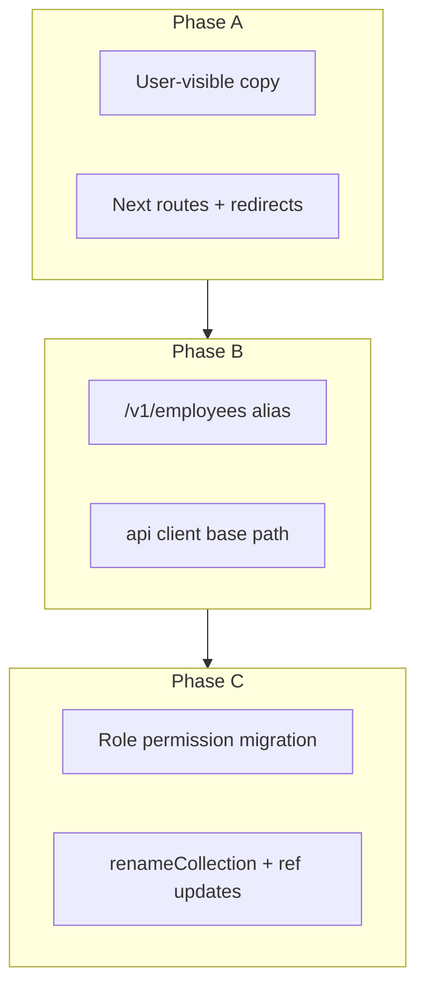

> **Master index:** For aggregated narrative (PDF roadmap + data-model note + document map), see [`2026-04-22-002-refactor-ats-candidate-employee-master-program-plan.md`](2026-04-22-002-refactor-ats-candidate-employee-master-program-plan.md). **T5** does *not* require new profile *fields*—the `Candidate` document already includes `employeeId` and neutral keys; the heavy lift is model/collection name and `ref: 'Candidate'` on **other** models.

# refactor: ATS Candidate → Employee rename (phased program)

## Overview

Dharwin will replace **“candidate”** product language and, over multiple releases, **API routes, client modules, database artifacts, and permission keys** so internal naming matches **“employee”** as decided by stakeholders. **Execution posture:** phased (Phase A → B → C), **not** a single release that renames the MongoDB collection and HTTP paths in one deploy.

**Success looks like:** users see “Employee” in the ATS; bookmarks and old URLs still work; integrations migrate on a published timeline; admin permissions behave identically after slug migration; rollback paths exist for each phase.

## Problem frame

- **Business:** Product language should reflect that listed people are **employees** (per stakeholder PDF and nav decision), not the generic ATS term “candidate.”
- **Technical:** The codebase encodes “candidate” across **dozens of backend files** (hot spots: `candidate.service.js` ~582 matches in-file, `candidate.route.js` ~84, `candidate.model.js`, `config/permissions.js`, plus attendance, offers, SOP, analytics) and **many frontend files** (e.g. `ats/candidates/page.tsx`, `shared/lib/api/candidates.ts`, `route-permissions.ts`, `sidebar/nav.tsx`, hooks `use-is-candidate.ts`). A naive global rename without phases risks **broken auth**, **404s**, and **data migration failure**.
- **Constraint:** Stakeholder choice of **phased delivery** (`.cursor/plans/ats_candidate_to_employee_rename.plan.md`).

## Requirements trace

| ID | Requirement |
|----|---------------|
| R1 | User-visible ATS labels and page titles use **Employee** (not Candidate) where product intends that meaning. |
| R2 | **Old app URLs** (`/ats/candidates/...`) continue to resolve (redirect) after route migration. |
| R3 | **HTTP API** exposes `/v1/employees` (or agreed path) as **alias** to current behavior; `/v1/candidates` is **deprecated** with a published cutoff, not removed silently. |
| R4 | **MongoDB** `candidates` collection and Mongoose `Candidate` model rename only in **Phase C**, with runbook and rollback. |
| R5 | **Permission slugs** (`candidates.*` → `employees.*` or agreed mapping) migrate without locking out administrators; roles retain equivalent access. |
| R6 | **No regression** on impersonation, public job apply, attendance, offers-placement, and activity logs for the rename program’s touched surfaces. |
| R7 | **Cross-module parity:** Surfaces outside the ATS folder that **list, pick, or label** people from the same domain (project management, attendance configuration, training attendance, teams, PM assistant, calls/Bolna flows) use **Employee** in user-visible copy and align **API/query parameters** with the phased backend contract—without breaking unrelated “candidate” strings (e.g. CS job interview “candidate” in generic English). |

## Scope boundaries

- **In scope:** Phases A–C as defined; internal naming strategy documents; migration scripts; QA matrices.
- **Out of scope for this program:** Unrelated ATS PDF items (offer letter PDF generation, “Today’s Onboarding” widget) except where rename **touches the same files**—coordinate PR sequencing.

### Deferred to separate tasks

- **Public job** copy: marketing may still say **“applicant”**; only align when product confirms (R1 disambiguation).
- **Role name** `user` in auth vs “employee” in UI—no change to auth role string unless a separate security/product decision is made.

## Research and key facts

**API evolution:** Industry practice is to keep **shared service logic** version-agnostic and use **routing** for `/v1` vs future versions; **URL path versioning** is common and cache-friendly ([Calmops: API versioning strategies](https://calmops.com/software-engineering/api-versioning-strategies/); [OneUptime: REST API versioning](https://oneuptime.com/blog/post/2026-01-26-rest-api-versioning/view)). For Dharwin, mounting **`/v1/employees` alongside `/v1/candidates`** with the **same** controller handlers matches “parallel path” deprecation without duplicating business logic.

**MongoDB rename:** `renameCollection` is **metadata-level** and **atomic**, preserving indexes, but takes **locks**; all app code, ETL, and dashboards must switch **before** or in **tight coordination** with rename ([MongoDB `renameCollection` command](https://www.mongodb.com/docs/manual/reference/command/renameCollection/); practical checklists in [TheLinuxCode collection rename guide](https://thelinuxcode.com/how-to-rename-a-collection-in-mongodb-safe-practical-and-production-ready/)). **Sharded** collections have additional restrictions—validate cluster topology before Phase C.

**Hiring terminology:** In recruitment products, **applicant/candidate** usually denotes **pre-hire pipeline**; **employee** denotes **post-hire** ([applicant pipeline concept](https://wild.codes/glossary/applicant-pipeline); [ATS glossary](https://curriculo.me/glossary/)). The product explicitly wants **“employee”** for this list; document in UX that **public job applicants** may still be labeled **applicant** until hired to avoid confusing **external** users.

## Context and relevant code

### Hot spots (non-exhaustive)

- **Backend — ATS core:** `src/routes/v1/candidate.route.js`, `src/controllers/candidate.controller.js`, `src/services/candidate.service.js`, `src/models/candidate.model.js`, `src/config/permissions.js`, `src/routes/v1/index.js`, `src/services/offer.service.js`, `src/services/jobApplication.service.js`.
- **Backend — attendance (joins and permissions on the same person record):** `src/services/attendance.service.js`, `src/middlewares/requireCandidateAttendanceList.js`, `src/middlewares/requireAttendanceAccess.js`, `src/middlewares/requireUserAttendanceView.js`, `src/routes/v1/attendance.route.js`, `src/validations/attendance.validation.js`, `src/controllers/attendance.controller.js`. *Inventory must confirm every `populate` / `ref` / permission string that still says `Candidate` or `candidates.*`.*
- **Backend — project management & PM AI:** `src/services/pmAssistant.service.js`, `src/routes/v1/pmAssistant.route.js`, `src/services/project.service.js`, `src/services/team.service.js`, `src/controllers/team.controller.js`, `src/services/meeting.service.js`, `src/services/callRecord.service.js` (and related Bolna/voice files where they resolve a **candidate** document). *These often pass `candidateId` through tasks, teams, and assignment runs—rename program must track **parameters and user-facing errors** alongside core ATS routes.*
- **Backend — other services that reference candidate:** `src/services/sopChecklist.service.js`, `src/services/supportTicket.service.js`, `src/services/atsAnalytics.service.js`, `src/services/recruiterActivity.service.js`, `src/services/placement.service.js`, `src/config/activityLog.js`—treat as **inventory-driven** in Unit 1; only change user strings or external identifiers per phase.
- **Frontend — ATS:** `app/(components)/(contentlayout)/ats/candidates/**`, `shared/lib/api/candidates.ts`, `shared/lib/candidate-permissions.ts`, `shared/lib/route-permissions.ts`, `shared/layout-components/sidebar/nav.tsx`, `shared/lib/constants.ts` (add `atsEmployees` alongside redirects).
- **Frontend — project management:** `app/(components)/(contentlayout)/project-management/teams/page.tsx`, `app/(components)/(contentlayout)/apps/projects/**` (e.g. `project-list`, `create-project`, `assignment/[runId]`, `edit/[projectId]`), `shared/lib/api/pmAssistant.ts`, `shared/lib/api/tasks.ts`, `shared/lib/pm/runAssignmentGenerationWithUi.ts`, `shared/components/pm/AiBootstrapProgressOverlay.tsx`, `app/(components)/(contentlayout)/task/kanban-board/**`. *Many of these reference “candidate” in UI or in types tied to PM assignment APIs.*
- **Frontend — attendance & training:** `shared/lib/api/attendance.ts`, `shared/lib/attendance-assign-people-options.ts`, `app/(components)/(contentlayout)/settings/attendance/candidate-groups/page.tsx`, `settings/attendance/**` (assign shift, week-off, holidays, backdated requests), `app/(components)/(contentlayout)/training/attendance/**`, `app/(components)/(contentlayout)/ats/candidates/_components/CandidateAttendanceOverlay.tsx`. *Route folder `candidate-groups` is a **T2** rename candidate (URL + redirects) once product approves.*
- **Frontend — shared hooks / auth:** `shared/hooks/use-is-candidate.ts`, `use-has-candidate-role.ts`, `use-is-candidate-for-profile.ts`—**internal hook names** may stay until a dedicated refactor unit to avoid churn; **user-visible strings** in consumers should still follow R1/R7.

### Institutional learnings

- Related plans in repo: `uat.dharwin.backend/docs/plans/2026-04-13-002-feat-candidate-user-lifecycle-sync-plan.md` and analytics alignment plan—**read before Phase C** to avoid conflicting lifecycle assumptions.

## Key technical decisions

1. **Phased program** (A: copy+routes, B: API aliases+client, C: DB+permissions)—stakeholder-approved; do not collapse phases without new approval.
2. **Express:** Prefer **mount same router** twice in `src/routes/v1/index.js` (e.g. `router.use("/candidates", candidateRoutes); router.use("/employees", candidateRoutes);`) *if* paths inside router are relative—otherwise extract shared `Router` factory. **Decision point** during implementation: verify no absolute `/candidates` string inside the router.
3. **Next.js:** `redirects` in `next.config.js` for `/ats/candidates` → `/ats/employees` (308 for GET) in addition to any in-app `ROUTES` updates.
4. **Permissions:** Prefer **`employees.read`** mirroring `candidates.read` with a **one-time** migration script for Role documents; keep **alias in middleware** that accepts **either** slug during transition if needed to reduce risk.
5. **Types:** `CandidateListItem` rename to `EmployeeListItem` only when the **public API** contract is agreed; until then, TypeScript can use **type alias** to avoid a single giant PR.
6. **User role (`Role` document) for workforce users:** A viable Phase C path is to create a new **`Role`** named **`Employee`** whose **`permissions` array** matches the current **Candidate** role, then **reassign** `User.roleIds` from Candidate’s role id to Employee’s. **This alone is not enough:** [`src/utils/roleHelpers.js`](../../../uat.dharwin.backend/src/utils/roleHelpers.js) and similar code **hard-code** `name: 'Candidate'`; [`shared/hooks/use-has-candidate-role.ts`](../../shared/hooks/use-has-candidate-role.ts) only treats role names `candidate` and `user`. **Dual-name** checks during migration, or **in-place** `Role.name` rename with coordinated deploy, avoids users losing ATS/profile behavior. This is **separate** from `candidates.*` **API permission** slug migration in `config/permissions.js` and from Mongo **`candidates` collection** rename (see origin feasibility note in `.cursor/plans/ats_candidate_to_employee_rename.plan.md`).

## High-level technical design

*Directional only—not implementation to copy.*

## Implementation units

### Unit 1: Inventory and governance

**Goal:** A searchable **rename matrix** (path → phase → owner) so PRs do not conflict—**including every backend/frontend file** that matches `candidate` / `candidates` / `Candidate` in **attendance**, **PM**, **teams**, **tasks**, **calls/Bolna**, **support tickets**, and **settings**, not only `ats/` and `candidate.*` route files.

**Requirements:** R1–R7 (planning enabler).

**Files:**

- Add: `docs/plans/2026-04-22-001-candidate-employee-inventory.md` (or section in this doc) — generated from `rg` with exclusions (`node_modules`, `.next`, `dist`).
- Reference: `shared/lib/impersonation-return-path.ts` (already uses route constants; update when `ROUTES.atsCandidates` renames).

**Test scenarios:** N/A (documentation).

**Verification:** Matrix rows exist for **each** high-count and cross-module file (e.g. `pmAssistant.service.js`, `attendance.service.js`, `project-management/teams/page.tsx`, `attendance-assign-people-options.ts`, `requireCandidateAttendanceList.js`), with a **phase tag** (A copy vs B API vs C schema).

---

### Unit 2: Phase A — copy and SEO

**Goal:** Replace user-visible “Candidate(s)” with “Employee(s)” **where product intent is the hired/placed person**—**ATS first**, then **project management** (teams, project list, assignment run UI, kanban), **attendance** settings and overlays, and **training attendance**—per Unit 1 matrix. Update `Seo` titles and breadcrumbs everywhere those pages expose “Candidate”.

**Requirements:** R1, R6, R7.

**Dependencies:** Unit 1.

**Files (modify, illustrative):**

- `shared/layout-components/sidebar/nav.tsx`
- `app/(components)/(contentlayout)/ats/candidates/page.tsx` (or post-rename `employees` folder — see Unit 3)
- `app/(components)/(contentlayout)/ats/candidates/**` (components, modals)
- **Project management:** `app/(components)/(contentlayout)/project-management/teams/page.tsx`, `apps/projects/**`, `task/kanban-board/**`, `shared/components/pm/AiBootstrapProgressOverlay.tsx`
- **Attendance / training:** `settings/attendance/**`, `training/attendance/**`, `ats/candidates/_components/CandidateAttendanceOverlay.tsx` (component file name may move in a later unit to `EmployeeAttendanceOverlay` when safe)
- Other ATS pages referencing “candidate” in headings: `ats/onboarding`, `ats/analytics`, `settings/candidates/sop` (product: may become “employee SOP” or stay settings path)

**Approach:** Grep for display strings, not `candidateId` variable names. **Do not** rename `shared/lib/api/candidates.ts` in this unit.

**Test scenarios:**

- **Happy path:** ATS sidebar shows **Employees**; main list title matches; **PM teams / project list** and **attendance settings** show “Employee” where the matrix marked user-facing.
- **Edge case:** Hooks named `use-is-candidate` still function; only **UI** copy changes in this unit unless explicitly agreed to rename hooks in Unit 3.
- **Integration:** Log in as Admin/Agent, open ATS **Employees** list, **project-management teams**, and **settings → attendance → candidate groups** (path label may still say `candidate-groups` until Unit 3), no console errors.

**Verification:** Screenshot or manual checklist sign-off for EN UI on **ATS + ≥1 PM screen + ≥1 attendance screen** from the matrix.

---

### Unit 3: Phase A — Next.js routes and `ROUTES`

**Goal:** Introduce `/ats/employees/...` as canonical; redirect from `/ats/candidates/...`.

**Requirements:** R2, R1.

**Dependencies:** Unit 2 (or parallel with close coordination).

**Files:**

- `next.config.mjs` or `next.config.js` — `redirects`
- `shared/lib/constants.ts` — e.g. `atsEmployees: "/ats/employees/"`, keep deprecated `atsCandidates` pointing to same or mark deprecated
- Move or duplicate pages under `app/(components)/(contentlayout)/ats/employees/**` (Next.js App Router: **move** reduces duplication; use git mv for history)
- **Update all internal `Link`/`router.push`** to new paths; update post-impersonation return in `app/(components)/(contentlayout)/ats/candidates/page.tsx` (and any `ROUTES.atsCandidates` usage) to `ROUTES.atsEmployees` when that constant is introduced

**Files — Test:** Any Playwright/Cypress if present; else manual.

**Test scenarios:**

- **Happy path:** Navigate to `/ats/employees` — list loads.
- **Edge case:** Open bookmarked `/ats/candidates` — lands on employees URL (308).
- **Error path:** No infinite redirect loop in `next.config` matcher.

**Verification:** `curl -I` on old path shows redirect in staging.

---

### Unit 4: Phase B — Express `/v1/employees` alias

**Goal:** `POST/GET/... /v1/employees* mirror /v1/candidates*` to same handlers.

**Requirements:** R3, R6.

**Dependencies:** Unit 1 inventory of route definitions.

**Files:**

- `src/routes/v1/index.js` — mount
- `src/routes/v1/candidate.route.js` — only if refactors needed (extract shared router)
- `src/middlewares/*` — any path checks for `/candidates` in string form; **attendance** and **pmAssistant** middleware if they branch on path or permission slug
- `src/services/pmAssistant.service.js`, `src/services/attendance.service.js` — confirm no **hard-coded** `/v1/candidates` strings that would skip the alias when clients switch to `/v1/employees`

**Test scenarios:**

- **Happy path:** `GET /v1/employees` (or first list endpoint) returns **same** as `GET /v1/candidates` for same auth.
- **Integration:** `publicApply` still hits **unchanged** public route unless product asks—likely **out of scope** for path rename in Phase B.

**Verification:** Add or extend **Jest** integration test if project has `supertest` pattern; else Postman collection check.

---

### Unit 5: Phase B — Frontend API client

**Goal:** `apiClient` calls use `/employees` base path; optional env `NEXT_PUBLIC_USE_EMPLOYEES_API=1` for cutover.

**Requirements:** R3, R4 (prepare).

**Files:**

- `shared/lib/api/candidates.ts` — **either** rename to `employees.ts` and re-export, **or** change `"/candidates"` string to `"/employees"` with single PR
- **Cross-module API modules** that call the same REST resource: `shared/lib/api/attendance.ts`, `shared/lib/api/pmAssistant.ts`, `shared/lib/api/tasks.ts`, `shared/lib/api/atsAnalytics.ts`, `shared/lib/api/supportTickets.ts`, `shared/lib/api/jobApplications.ts`—inventory in Unit 1 for any `"/candidates"` or `candidateId` **path segment** that must track Phase B
- `shared/lib/api/client.ts` — if base path is shared
- **All imports** of `@/shared/lib/api/candidates` — update if file renamed (large diff; coordinate)

**Test scenarios:**

- **Happy path:** List employees loads after Phase B deploy against backend with alias.
- **Error path:** 404 if backend not deployed first — **order: deploy API alias before** switching default client, or use feature flag.

**Verification:** CI build passes; smoke test on staging.

---

### Unit 6: Phase C — Permission migration

**Goal:** DB migration script: for each role (or permission store), map `candidates.*` → `employees.*`; seed defaults updated.

**Requirements:** R5, R6.

**Dependencies:** Phase A+B stable in production for one sprint (recommended).

**Files:**

- `src/config/permissions.js` — new slugs
- `src/middlewares/*` — `requirePermission` strings
- New script: `scripts/migrate-candidate-permissions-to-employee.mjs` (or Mongoose migration)

**Test scenarios:**

- **Happy path:** Admin with old slug migrated retains access.
- **Edge case:** Custom role with only `candidates.read`—after migration, `employees.read` present.
- **Rollback:** Script outputs backup JSON or uses transaction where supported.

**Verification:** Staging UAT with real role dump clone.

---

### Unit 7: Phase C — MongoDB model and collection

**Goal:** `renameCollection` + update Mongoose `collection` name and all `ref: 'Candidate'` to `'Employee'` (or keep ref name if model class renamed only—**team decision**).

**Requirements:** R4, R6.

**Dependencies:** All services updated to new model name; **downtime window** agreed.

**Files:**

- `src/models/candidate.model.js` → `employee.model.js` (or model rename in place)
- `src/services/*.js` — imports
- `src/services/attendance.service.js` — aggregations using collection name
- `src/index.js` or model register

**Test scenarios:**

- **Integration:** Create/read/update employee record after migration.
- **Sharded cluster:** If applicable, use migration playbook from [MongoDB docs](https://www.mongodb.com/docs/manual/reference/command/renameCollection/) (sharding limits).

**Verification:** Staging full regression; `mongosh` count before/after match document counts.

## System-wide impact

- **Auth / permissions:** `getMyPermissions` and route guards in `shared/lib/route-permissions.ts` must list **new** slugs; **paranoia:** dual-accept slugs during transition.
- **Activity logs:** `activity-log-catalog.ts` may reference “candidate” in user-facing labels—align with R1.
- **External:** Any mobile app or third-party using `/v1/candidates` must be notified before Phase B cutover; maintain alias until EOL.
- **Impersonation return path** uses `ROUTES.atsCandidates` in `app/(components)/(contentlayout)/ats/candidates/page.tsx` — must update to `atsEmployees` when constant renames.
- **Project management:** Assignment runs, team member pickers, and PM assistant prompts that say “candidate” must stay **behaviorally identical** when relabeling; **API request bodies** may still use `candidateId` until Phase C clarifies field names (document in inventory).
- **Attendance:** `requireCandidateAttendanceList` and **candidate groups** settings govern the same user list as ATS—permission and copy changes must release in **lockstep** with Phase C if slugs change; avoid half-migrated labels (`candidates.read` in DB, “Employee” in UI) without dual-slug middleware.
- **Unchanged invariants:** `POST /v1/public/jobs/:id/apply` behavior (unless explicitly in scope); **User** model name unchanged.

## Risks and dependencies

| Risk | Likelihood | Impact | Mitigation |
|------|------------|--------|------------|
| Phase B backend deployed after frontend (404 on `/employees`) | Med | High | **Deploy order** document; feature flag on client. |
| Permission migration locks out admins | Low | High | Staging dry run; **dual slug** in middleware 1 release. |
| `renameCollection` on sharded cluster | Low (if sharded) | High | Check topology; use copy+switch if needed ([MongoDB limitations](https://www.mongodb.com/docs/manual/reference/command/renameCollection/)). |
| “Employee” on public job confuses **applicants** | Med | Med | R1: keep **applicant** on public pages per product review. |
| Merge conflicts across large file touch set | High | Med | **Phase A/B per vertical** (ATS first, then **attendance + PM** in the same release train) or **single** long-lived branch with rebases; Unit 1 matrix assigns **owner per vertical**. |
| PM/attendance screens ship with old API path strings | Med | High | Unit 5 explicitly includes `pmAssistant` + `attendance` API modules; staging grep for `"/candidates"` after deploy. |

## Resources, tools, and budget (indicative)

| Category | Notes | Cost |
|----------|--------|------|
| **Engineering** | 1–2 full-stack devs, 0.5 QA, 0.25 DevOps for Phase C | Staff time; **8–20 engineering days** spread across phases (org-dependent). |
| **Tools** | Existing `rg`, Jest, Postman, MongoDB shell, staging cluster | $0 |
| **Learning** | Internal: read `config/permissions.js` and `role.service.js` | — |

*Budget is effort-based; no new SaaS required for the rename program itself.*

## Definition of success

1. **Phase A (30–45 days from kickoff, indicative):** Staging shows **Employees** in ATS nav and **redirects** work; UAT sign-off.
2. **Phase B (next window):** `/v1/employees` and frontend client use it; **no** S1 incidents on auth; Postman or automated checks green.
3. **Phase C (scheduled maintenance):** DB migration + permission migration complete; **zero** P1 permission outages; rollback tested once.
4. **Documentation:** `DEPRECATION.md` or README section: `/v1/candidates` EOL date.
5. **Closure:** Grep in **production** bundle shows no user-facing "Candidate" in ATS (except historical audit strings if required by compliance).

## Recommended first 3 actions (next 7 days)

1. **Run scoped inventory:** `rg -n "candidate" uat.dharwin.backend/src --glob '!**/node_modules/**' | head` and same for `uat.dharwin.frontend` (no code changes) → **publish matrix** in a doc under `docs/plans/`.
2. **Product/UX 30 minutes:** confirm **public job** and **pre-hire** screens keep **applicant** vs **employee** wording to match hiring glossary expectations.
3. **Spike (4 hours):** In a branch, `router.use("/employees", candidateRoutes)` proof-of-concept in `index.js` + one GET—prove **no** path collision.

## Sources and references

- **Origin plan:** monorepo `.cursor/plans/ats_candidate_to_employee_rename.plan.md` (stakeholder phased decision).
- [API versioning / deprecation (Calmops)](https://calmops.com/software-engineering/api-versioning-strategies/)
- [MongoDB renameCollection](https://www.mongodb.com/docs/manual/reference/command/renameCollection/)
- [Hiring / applicant pipeline terminology](https://wild.codes/glossary/applicant-pipeline)

---

*Plan produced for Dharwin monorepo (`uat.dharwin.frontend` + `uat.dharwin.backend`). Execution (code) is out of scope for this document until approved.*
