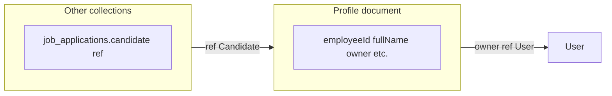

# Master program: Candidate → Employee (Dharwin full-stack)

This file is the **single entry point** for stakeholders and implementers. It **aggregates** the monorepo origin brief, the **ce-plan** [**001**](2026-04-22-001-refactor-ats-candidate-employee-rename-program-plan.md), Cursor-generated plans (some filenames exist only under the user-level Cursor `plans` directory), the **ATS revised flow (PDF) review**, and the **candidate field feasibility** note. **Authoritative implementation detail** (units 1–7) for the **rename** lives in **001**. Sections below summarize PDF-roadmap and data-model work so this document stays **self-contained** in the repo.

**Target repos (monorepo layout):** `uat.dharwin.frontend`, `uat.dharwin.backend`.

---

## Document map — which artifact to use

| Need | Read |
|------|------|
| Stakeholder tiers T1–T6, User-role migration feasibility | [`.cursor/plans/ats_candidate_to_employee_rename.plan.md`](../../../.cursor/plans/ats_candidate_to_employee_rename.plan.md) |
| **Rename — units, files, tests (ce-plan)** | [`2026-04-22-001-refactor-ats-candidate-employee-rename-program-plan.md`](2026-04-22-001-refactor-ats-candidate-employee-rename-program-plan.md) |
| **Data model** — profile fields unchanged; work is `ref` / collection / `ref: 'Candidate'` | [§ Data model (profile fields vs. cross-collection refs)](#data-model-profile-fields-vs-cross-collection-refs) |
| **PDF roadmap** — apply P0, screening, offer doc, dashboard | [§ Related program: ATS revised flow (PDF)](#related-program-ats-revised-flow-pdf) |
| **Cursor** one-pager + todos | [§ Cursor rename snapshot](#cursor-rename-snapshot) (or your local `ats_candidate_employee_rename_4f74180a.plan.md`) |
| **This master** — prioritization, checklist, research | This file |

---

## Data model (profile fields vs. cross-collection refs)

*Source: `candidate_field_feasibility_note_96bbc731.plan.md`.*

- The main ATS **profile** document in [`candidate.model.js`](../../../uat.dharwin.backend/src/models/candidate.model.js) already uses **neutral / employee-oriented field names** (e.g. `employeeId`, `fullName`, `owner` → `User`). You **do not** need a second parallel field set for “Employee” on that document—**T5** is about **Mongoose model name**, **collection name**, and **raw queries**, not new columns.
- **Other collections** still use **subdocument fields** often named `candidate` with `ref: 'Candidate'` (e.g. `jobApplication`, `callRecord`, `offer`, `placement`, `supportTicket`, `candidateGroup`, `assignmentRow`, `recruiterActivityLog`, `sopNotificationState`). Those **must** be updated when the model is renamed, or the `ref` string breaks.
- **Optional follow-up:** Rename JSON **keys** from `candidate` → `employee` on those models in a **later** release to limit API blast radius; not required for DB correctness if `ref` and model name are updated consistently.

---

## Related program: ATS revised flow (PDF)

*Source: `ats_revised_flow_review_d632da97.plan.md`. This is a **separate** product/implementation track from the **rename** program; they **interact** on navigation copy (P1) and file overlap—**coordinate PRs**.*

| PDF theme | Intent | Relation to rename |
|-----------|--------|---------------------|
| **P0** Public apply from link | Fix API/client error | **Independent**; do first. Regression-test after rename if same files touch `public-job`. |
| **Nav: Candidates → Employees** | Label / list semantics | **Overlaps** rename Phase A; **open product question** whether the current list is all applicants or hired-only (PDF assumes hired/payroll). |
| **Screening Rejected/Selected** | Job application / stage | Workflow feature; not the rename. |
| **Offer letter (address, job type, R&R, training)** | Rich offer doc | New fields/templates; coordinate with `offers-placement` if same routes. |
| **Joining date + reminders + Today’s Onboarding** | Dashboard + scheduled jobs | New surfaces; use `joiningDate` on profile. |
| **Enable as Employee** | HR action from offer | May align with **User `Role`** / status work in Phase C—**explicit** design link to 001 decision 6. |

**Suggested PDF phases (do not renumber rename A/B/C):** Phase 0 apply fix → Phase 1 product/navigation → screening → offer doc → joining/reminders/dashboard → enable-as-employee.

**Open questions (from PDF review)** that affect **both** programs: (1) Should **Candidates** be renamed globally or should **Employees** be a **separate** list? (2) What is the exact system action for “Enable as Employee”? (3) Is PDF **required** on day one or structured fields first?

---

## Cursor rename snapshot

*Condensed from `ats_candidate_employee_rename_4f74180a.plan.md`.*

- **Goal:** Align naming, routes, HTTP, persistence with **Employee**; keep legacy URLs via redirects and API aliases through Phase C.
- **Phases A/B/C:** Copy + routes; `/v1/employees` alias + clients; permissions + Mongo + model refs; cross-module scope includes **PM** and **attendance** (see 001 R7).
- **First 3 actions:** (1) `rg` inventory matrix under `docs/plans/`, (2) product: applicant vs employee on public pages, (3) Phase A: `atsEmployees` in `shared/lib/constants.ts`, redirects, ATS copy.

---

# Feature-engineer — product value and prioritization

**Mode:** C (prioritization) + D (spec-style goals). **Product:** Dharwin internal ATS + HR-adjacent workflows (PM, attendance). **Users:** Recruiters/admins/agents (high frequency), employees/candidates (lower frequency on public flows).

### Why this program matters

- **Terminology alignment:** Internal users stop mentally mapping “candidate” to “the people we already track as workforce” when the product narrative is **employee-first** (stakeholder PDF / nav decision—see origin brief).
- **Cross-surface consistency:** The same person record appears in **ATS**, **project management**, **attendance**, **calls**, and **support**; inconsistent labels erode trust and increase support tickets (“is this the same person?”).
- **Technical debt reduction:** Phased **API alias + redirect** strategy avoids a fragile big-bang rename of Mongo collections and permission keys.

### Prioritization matrix (build order within the program)

| Workstream | Reach | Impact | Confidence | Effort | Recommendation |
|------------|-------|--------|------------|--------|----------------|
| Phase A — copy (ATS + PM + attendance UI) | High | High | High | Med | **Build first** — visible win, lower risk |
| Phase A — routes + `ROUTES` + Next redirects | High | High | High | Med | **Build first** (after or parallel to copy with coordination) |
| Phase B — `/v1/employees` alias + clients | Med | High | Med | Med | **Plan next** — needs deploy order discipline |
| Phase C — permissions + Mongo rename | Med | Very high | Med | High | **Scheduled** window; dual-slug safety |
| Public job “applicant” copy decision | High | Med | Low (product) | Low | **Resolve early** — blocks some R1 strings |

**Build order (summary):** (1) Inventory matrix, (2) product copy decision for **public** vs **internal**, (3) Phase A UI + routes, (4) Phase B API + clients including `pmAssistant` and `attendance` API modules, (5) Phase C data + auth migration.

### Goals and non-goals (spec-style)

**Goals**

- G1: **R1–R7** satisfied as defined in 001 (user-visible Employee where intended; redirects; API alias; DB/permissions migration; cross-module parity).
- G2: **Zero** admin lockout from permission renames; **zero** S1 from deploy order if follow alias-first rollout.
- G3: **Published** deprecation for `/v1/candidates` with replacement and dates (see API deprecation research below).

**Non-goals**

- NG1: Rewriting unrelated ATS roadmap items (offer PDF polish, “Today’s Onboarding” widget) **except** file overlap—coordinate PRs.
- NG2: Renaming the auth role string `user`—out of scope unless a separate security decision.
- NG3: Blind global replace of the English word “candidate” in non-domain contexts.

---

# Deep project planner — program narrative

## Goal

Dharwin’s **user-facing and technical** naming for the primary “person” entity in the ATS and connected modules **converges on Employee**, while **legacy URLs, HTTP paths, and stored permission data** are migrated on a **published, phased timeline** with rollback options—avoiding a single “big bang” release.

**Estimated timeline:** **8–20 engineering days** of focused effort *spread across multiple sprints* (from 001), plus UAT and a scheduled **Phase C** window; calendar duration often **6–12 weeks** org-dependent (phased gates, not continuous coding).

**Difficulty level:** **High** — cross-cutting rename touching Express routing, Next.js App Router, MongoDB, embedded role permissions, and multiple product surfaces (ATS, PM, attendance). Rationale: **coordination and blast radius**, not individual task complexity.

---

## Research and key facts

**Incremental modernization:** The program’s **Phase A → B → C** structure matches the **strangler fig** pattern: run **new** paths and behavior **in parallel** with legacy, then **retire** the old contract when traffic and data migrations allow ([AWS Prescriptive Guidance — Strangler Fig](https://docs.aws.amazon.com/prescriptive-guidance/latest/modernization-decomposing-monoliths/strangler-fig.html); [Baeldung — Strangler pattern](https://www.baeldung.com/cs/microservices-strangler-pattern)). Dharwin’s **parallel** `/v1/employees` and `/v1/candidates` (same handlers) is the “coexist” phase; removing the old path is the final “eliminate” step after consumers migrate.

**API deprecation and trust:** Public and partner expectations favor **what / why / when / replacement / how to migrate** in deprecation comms; documentation and **Sunset**-style HTTP signals are common patterns ([Codelit — API deprecation strategy](https://codelit.io/blog/api-deprecation-strategy); [Nordic APIs — breaking changes lifecycle](https://nordicapis.com/how-to-manage-breaking-changes-throughout-an-apis-lifecycle/)). For Dharwin, publish a **cutoff date** for `/v1/candidates` in the same place integrations look (README, changelog, or internal Notion—team choice).

**MongoDB:** `renameCollection` is **atomic** for metadata but has **operational** constraints (locks, sharding); 001’s runbook + staging rehearsal remains authoritative ([MongoDB `renameCollection`](https://www.mongodb.com/docs/manual/reference/command/renameCollection/)).

**Hiring terminology (UX law):** Industry glossaries distinguish **applicant** (early interest), **candidate** (evaluated/shortlist), and **employee** (post-hire) ([Predictive Index — applicant vs candidate](https://predictiveindex.com/blog/applicant-vs-candidate-best-practices); [Tribepad — ATS glossary](https://tribepad.com/glossary/)). Dharwin’s product choice to say **Employee** in internal lists does **not** require calling external job seekers “employees” on public pages—**R1 disambiguation** and **R7** in 001.

**Recap of 001’s cited technical sources:** URL path versioning and parallel routes ([Calmops](https://calmops.com/software-engineering/api-versioning-strategies/)); applicant pipeline term ([wild.codes glossary](https://wild.codes/glossary/applicant-pipeline)).

---

# Phased delivery — step-by-step to-dos

Each phase lists **5–10** concrete items. **Checkbox ownership** should map to the Unit 1 matrix (vertical owner: ATS / PM / Attendance / Platform).

## Phase A — User-visible “Employee” + App routes (T1 + T2)

*Estimated duration: one sprint+ (indicative 2–4 weeks calendar with QA).*

> Delivers: consistent **labels** across ATS, PM, and attendance; **canonical** `/ats/employees/...` with **redirects** from legacy paths; updated **`ROUTES`** and impersonation return paths that reference `atsCandidates`.

- [ ] **Inventory:** Generate `docs/plans/2026-04-22-001-candidate-employee-inventory.md` (or equivalent) with **module tags** (ATS, PM, attendance, calls, support)—see **Unit 1** in 001.
- [ ] **Product:** Decide **public job** and **pre-hire** copy (`applicant` vs `employee`) and document in the matrix.
- [ ] **Copy pass — ATS:** Nav, `Seo`, list/detail strings under `app/(components)/(contentlayout)/ats/candidates/**` (or successor folder after move).
- [ ] **Copy pass — PM:** `project-management/teams`, `apps/projects/**`, `task/kanban-board/**`, PM assistant toasts (per 001 file list).
- [ ] **Copy pass — Attendance / training:** Settings attendance, `CandidateAttendanceOverlay` user strings, `attendance-assign-people-options` labels.
- [ ] **Constants + links:** Add `atsEmployees` (or agreed name) in `shared/lib/constants.ts`; update internal `Link`/`router.push` per matrix.
- [ ] **Next redirects:** `next.config` **308** (GET) for `/ats/candidates/*` → `/ats/employees/*` (or matcher strategy per Next version).
- [ ] **App Router move:** `git mv` to `ats/employees/**` when ready; avoid duplicate trees long-term.
- [ ] **QA — bookmarks:** Old bookmarks, sidebar, deep links, **exit impersonation** return URL.

## Phase B — HTTP alias + client cutover (T3 + T4)

*Estimated duration: one sprint (indicative); requires **backend-before-frontend** or feature flag.*

> Delivers: **`/v1/employees`** mirrors **`/v1/candidates`**; frontend and cross-module clients (`candidates.ts`, `attendance.ts`, `pmAssistant.ts`, `tasks.ts`, etc.) use the new path segment; **deprecation** published.

- [ ] **Express:** Mount existing candidate router (or shared factory) at `/employees` in `src/routes/v1/index.js`; confirm **no** absolute `/candidates` strings inside the router break aliasing.
- [ ] **Middleware:** Audit `src/middlewares/*` for path or slug string equality on `candidates`.
- [ ] **Services:** Grep `src/services` for hard-coded `/v1/candidates` (attendance, pmAssistant, job application flows).
- [ ] **Frontend client:** Switch base path in `shared/lib/api/candidates.ts` (or rename module with re-exports); update **all** cross-module API files listed in **Unit 5** of 001.
- [ ] **Deprecation comms:** Changelog + sunset date; optional `Deprecation` / `Sunset` response headers for API responses ([RFC 8594](https://www.rfc-editor.org/rfc/rfc8594.html) patterns per [Codelit](https://codelit.io/blog/api-deprecation-strategy)).
- [ ] **Integration QA:** Postman (or Jest+supertest if present) proves parity for at least list + read + one write on **both** paths.
- [ ] **Deploy order runbook:** Backend alias **before** default client cutover, or **env flag** to flip client.

## Phase C — Permissions + database (T5 + T6)

*Estimated duration: maintenance window + validation; may span 1–2 weeks calendar including UAT.*

> Delivers: **Role documents** and `permissions.js` use **`employees.*`**; **Mongo** collection and Mongoose `ref` names updated; **activity/audit** labels aligned where user-facing. **Also:** optional **User `Role` migration** (new `Employee` role row with same permissions as `Candidate`, then reassign `User.roleIds`)—must ship **with** code that stops matching only `name: 'Candidate'` (see `.cursor/plans` feasibility section and 001 decision 6).

- [ ] **Dual-slug period:** Middleware accepts **both** `candidates.*` and `employees.*` for one release if needed (per 001 key decisions).
- [ ] **Workforce User role:** Create `Employee` **Role** (clone Candidate permissions) **or** rename `Role.name` in place; update `userHasCandidateRole`, `candidate.service` role lookups, `use-has-candidate-role.ts`; migrate `User.roleIds`; verify counts before/after.
- [ ] **Migration script:** Role/permission backfill; backup JSON; dry run on staging clone.
- [ ] **Model + collection:** `renameCollection` (or copy-switch if sharded) + `candidate.model.js` → `employee.model.js` (exact strategy per 001 Unit 7).
- [ ] **Aggregations:** `attendance.service.js` and any raw collection name references.
- [ ] **Seeds and defaults:** `role.service.js` / seeds aligned with new slugs.
- [ ] **Rollback rehearsal:** Document restore order (DB + deploy).
- [ ] **Go-live comms:** Internal-only who is affected; support macro for “permission denied after migration.”

---

## Alignment to ce-plan implementation units (001)

| Master phase | 001 units |
|--------------|-----------|
| Phase A (copy + routes) | Units 1–3 |
| Phase B (API + clients) | Units 4–5 |
| Phase C (DB + auth) | Units 6–7 |

**Execution note:** Do not start Unit 7 until Units 4–5 are stable in production and the inventory shows no **orphan** `ref: 'Candidate'` in untested scripts.

---

## System-wide invariants (from 001, summarized)

- **Impersonation:** Post-exit return must track `ROUTES.atsEmployees` when constants migrate (`app/(components)/(contentlayout)/ats/candidates/page.tsx` today).
- **PM / attendance API bodies:** `candidateId` may remain in JSON until a **field rename** is explicitly in scope for Phase C—document in inventory to avoid drive-by renames.
- **Public apply:** `POST` public job apply behavior is **unchanged** unless product adds scope; still test for regressions (R6).

---

## Risks and challenges

| Risk | Likelihood | Impact | Mitigation strategy |
|------|------------|--------|---------------------|
| Frontend ships before Express alias (404 on `/v1/employees`) | Med | High | Deploy order doc; feature flag; smoke test in staging with **both** deploy orders once |
| Permission migration without dual-slug | Low | **Critical** | Staging dry run; optional dual-accept in middleware (001) |
| `renameCollection` on sharded or busy cluster | Low–Med | High | Validate topology; maintenance window; fallback copy+switch |
| Inconsistent “Employee” on **public** pages | Med | Med | **Applicant** / **apply** copy per product; separate from internal ATS |
| Merge conflicts (large touch set) | High | Med | Unit 1 **owners** per vertical; merge train or single long-lived branch |
| PM/attendance clients miss path update | Med | High | **Unit 5** explicit module list; grep `"/candidates"` in `shared/lib/api` in CI or pre-release |
| Conflicting **lifecycle** docs in backend (older plans) | Med | Med | Read `uat.dharwin.backend/docs/plans/2026-04-13-002-feat-candidate-user-lifecycle-sync-plan.md` before Phase C |
| Integrations unaware of API deprecation | Med | Med | Changelog, email, date-bound sunset; keep alias until EOL |

---

## Resources, tools, and budget (master rollup)

| Category | Detail |
|----------|--------|
| **People** | 1–2 full-stack (Express + Next + Mongo), 0.5 QA, 0.25 DevOps for Phase C; **product/UX** 2–4 hours for public copy |
| **Tools** | `rg`, existing Jest/Postman, Mongo shell, staging cluster, optional CI grep for `"/candidates"` path segment |
| **Budget** | No new **SaaS** required; cost is **staff time** (see 001 effort range) |
| **Learning** | [AWS Strangler Fig](https://docs.aws.amazon.com/prescriptive-guidance/latest/modernization-decomposing-monoliths/strangler-fig.html); [API deprecation comms](https://codelit.io/blog/api-deprecation-strategy); internal: `src/config/permissions.js` |

---

## Definition of success (master-level)

1. **Adoption:** All **internal** surfaces in scope show **Employee** for the intended entity (R1, R7); **public** copy follows the written **applicant/employee** decision.
2. **Stability:** No P1 from **auth** or **404** attributable to the rename; impersonation and attendance **list** paths validated.
3. **Contract:** `/v1/employees` is **the documented** path; `/v1/candidates` has a **published** EOL (or remains alias indefinitely—explicit decision).
4. **Data:** After Phase C, collection/model refs match the runbook; **rollback** was rehearsed at least once in staging.
5. **Program closure:** Deprecation doc exists; support knows the **cutover window**; engineering grep shows **no accidental** `"/candidates"` in **new** client code post-EOL (allow listed exceptions documented).

---

## Recommended first 3 actions (next 7 days)

1. **Publish the inventory** (Unit 1) with **vertical owners** and link it from the team channel / ticket epic.
2. **30-minute product review:** public job + landing copy vs internal ATS (applicant / employee) — record outcome in the inventory header.
3. **Spike + PR sketch:** `router.use("/employees", …)` in `src/routes/v1/index.js` + one authenticated GET in staging to **de-risk** Unit 4 before large frontend churn.

---

## Master sources (bibliography)

- **001 technical plan (rename, units 1–7):** [`2026-04-22-001-refactor-ats-candidate-employee-rename-program-plan.md`](2026-04-22-001-refactor-ats-candidate-employee-rename-program-plan.md)
- **Origin brief (monorepo):** [`.cursor/plans/ats_candidate_to_employee_rename.plan.md`](../../../.cursor/plans/ats_candidate_to_employee_rename.plan.md)
- **Cursor (user `plans` dir, if present):** `ats_candidate_employee_rename_4f74180a.plan.md`, `candidate_field_feasibility_note_96bbc731.plan.md`, `ats_revised_flow_review_d632da97.plan.md` — content summarized in this **002** for repo portability
- **Strangler fig:** [AWS](https://docs.aws.amazon.com/prescriptive-guidance/latest/modernization-decomposing-monoliths/strangler-fig.html)
- **API deprecation:** [Codelit](https://codelit.io/blog/api-deprecation-strategy), [Nordic APIs](https://nordicapis.com/how-to-manage-breaking-changes-throughout-an-apis-lifecycle/)
- **HR terminology:** [Predictive Index — applicant vs candidate](https://predictiveindex.com/blog/applicant-vs-candidate-best-practices), [Tribepad glossary](https://tribepad.com/glossary/)
- **MongoDB:** [renameCollection](https://www.mongodb.com/docs/manual/reference/command/renameCollection/) (unchanged; see 001 for operational detail)

---

*This master plan is a **navigation and strategy** document. For file-level tasks, test scenarios, and mermaid flow, use **001**. Implementation requires explicit **execute** approval; planning-only until then.*
