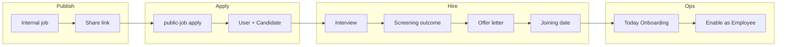

Byte-for-byte content from `ats_revised_flow_review_d632da97.plan.md` (paths adjusted to repo-relative where helpful). PDF file path in the source overview may differ on your machine.

# ATS revised flow — feasibility and implementation plan

## Source document (PDF) — requirements summary

| Area | PDF asks for |
|------|----------------|
| Jobs | Admin posts JD → Internal Jobs; share link with candidate |
| Apply | Candidate applies via link → DharwinOne account (name, email, address, password, resume) → track status; **apply from link currently errors** (example URL in doc) |
| Nav | **Rename “Candidate” list to “Employees”** (doc: they are hired / payroll) |
| Interview | Team schedules interview/screening call (after apply) |
| Screening | Recruiter sets outcome: **Rejected / Selected** |
| Offer | **Generate offer letter** with: full name, address, position, joining date, job type (FT 40h / PT 25h / training-unpaid internship / FT), plus **Roles & Responsibilities** and **Training & Learning Outcomes** derived from position |
| Joining | Capture joining date when offer sent; **reminder on joining date** for onboarding |
| Dashboard | **“Today’s Onboarding”** for Admin + Agents |
| HR | Agent **enables candidate as Employee**; position + joining date from offer; then same as current process |

---

## Complexity

**7/10** — One P0 production bug (public apply), plus naming/product clarity, workflow alignment (screening → offer), document-style offer content vs existing CTC-based offers, scheduling/reminders, and a new dashboard widget. Not a single CRUD feature; several systems touch auth, jobs, applications, candidates/users, and notifications.

---

## Feasibility (high level)

- **Public apply error:** Feasible and should be **first priority**. Frontend already implements [`public-job/[jobId]/page.tsx`](../../app/(components)/(authenticationlayout)/public-job/[jobId]/page.tsx) calling `publicApplyToJob` → backend [`POST /v1/public/jobs/:jobId/apply`](../../../uat.dharwin.backend/src/routes/v1/public.route.js). Root cause is likely API validation, CORS, env/base URL, job state, or payload (file upload)—**debug with network trace on the failing Vercel URL**, not a greenfield build.
- **Rename “Candidates” → “Employees”:** Trivial in the UI **if** the list truly represents only hired/payroll staff. In this codebase, [`ats/candidates/page.tsx`](../../app/(components)/(contentlayout)/ats/candidates/page.tsx) is a **general ATS candidate list** (often pre-hire). Renaming globally may **confuse** ATS users. **Decision needed:** rename nav label only for a **filtered** view, introduce a separate **Employees** route, or keep “Candidates” for applicants and add **“Employees”** as a different list (see Open questions).
- **Screening Rejected/Selected:** Partially aligned with existing **job application** statuses used in [`offers-placement/create`](../../app/(components)/(contentlayout)/ats/offers-placement/create/page.tsx) (`Applied`, `Screening`, `Interview`, etc.). May need status transitions + UI on the right entity (application vs candidate).
- **Offer letter (rich fields + R&R by position):** Today’s **Create Offer** flow is **CTC/joining/validity** oriented ([`createOffer`](../../shared/lib/api/offers.ts) pattern), not a full **letter document** with address, job type enum, and generated sections. Extending models/APIs/templates is **medium–large**; industry pattern is template + merge fields + PDF ([e.g. Zoho Recruit offer management](https://www.zoho.com/recruit/offer-management.html), [Gem offer flow](https://help.gem.com/external/gem-ats-sending-offers-e-signature-requests)).
- **Joining reminders + “Today’s Onboarding”:** Feasible using existing **joining date** concepts on candidates where present; needs a **query** for “joining date = today” (and permissions) plus a **notification** channel (email/in-app/calendar) if “reminder” is automatic.

---

## Phases (suggested order)

### Phase 0 — Fix public apply (P0)
- Reproduce error on `public-job/:id` against production/staging API.
- Inspect `publicApplyToJob` payload, multipart upload, job `id` validity, and backend `public` controller errors.
- Add logging or user-visible error from existing `getApplySubmissionErrorMessage` path if needed; fix server or client.

### Phase 1 — Product clarity: labels and navigation
- Resolve **Candidates vs Employees** (see Open questions). Update sidebar/SEO labels in [`.../contentlayout` menus](../../app) only after the product decision.
- Ensure **Internal Jobs** + share URL behavior matches the doc (already referenced from [`ats/jobs/page.tsx`](../../app/(components)/(contentlayout)/ats/jobs/page.tsx)).

### Phase 2 — Screening outcome
- Map PDF **Rejected/Selected** to your **job application** (or candidate stage) model; ensure API allows transition from Screening/Interview; surface controls for recruiter on the right screen (candidate row or application detail).

### Phase 3 — Offer letter (document + data)
- **Gap vs PDF:** Extend offer creation beyond current CTC-focused create flow: store **address**, **job type**, **R&R** and **training outcomes** (template per position or generated text).
- Options: (a) PDF/HTML template + merge fields, (b) start with structured fields + “preview” only, (c) e-sign later.

### Phase 4 — Joining date + reminders + dashboard
- **Capture joining date** at offer send (or first editable moment); sync to candidate/employee record as in doc.
- **Reminders:** cron/queue or scheduled job in backend, or calendar integration—pick one.
- **“Today’s Onboarding”:** New dashboard card for Admin/Agent: filter users/candidates with `joiningDate` = today (timezone-aware), links to profile/onboarding action.

### Phase 5 — “Enable as Employee”
- Align with existing user/candidate/role flags; may be a **status** + **role assignment**; reuse permissions patterns from settings/users.

---

## Frontend (Dharwin)

| Item | Suggestion |
|------|------------|
| **modify** | [`public-job/[jobId]/page.tsx`](../../app/(components)/(authenticationlayout)/public-job/[jobId]/page.tsx) — only if client-side fix needed after API diagnosis |
| **modify** | ATS sidebar / [`candidates/page.tsx`](../../app/(components)/(contentlayout)/ats/candidates/page.tsx) — labels or split routes per Phase 1 |
| **modify / new** | Dashboard layout — widget **Today’s Onboarding** |
| **modify** | [`offers-placement`](../../app/(components)/(contentlayout)/ats/offers-placement/) — offer form + list to match new letter fields |

**State / UX:** Offer wizard should avoid blocking on optional fields; screening buttons should confirm destructive “Rejected”.

---

## Backend

| Item | Suggestion |
|------|------------|
| **investigate** | `POST /v1/public/jobs/:jobId/apply` handler and validation (file fields, job status, email uniqueness) |
| **likely modify** | Job application / offer models for new fields; migration if new columns |
| **new or extend** | Reminder job (if not using external scheduler) for joining-date notifications |

**Business logic (from PDF):** Only **Selected** paths advance to offer; offer drives **joining date**; onboarding dashboard reads same date.

---

## Database

- Depends on whether offer and application tables already support **job type**, **address on offer**, and **template sections**. If not: **migrations** on offer and/or `JobApplication` with backward-compatible defaults.

**Migrations:** Plan additive fields first; avoid renaming core tables until product naming is settled.

---

## Tech and modules (already have vs add)

- **Already have:** Next.js public job pages, `publicApiClient` apply, ATS candidates, interviews, offers-placement with CTC offers, job applications with statuses, dashboard shell.
- **May need to add:** PDF/HTML generation (e.g. existing lib or server-side template), **cron** or **Bull**-style queue for reminders (if not present), optional **email templates** for reminders.

---

## Integrations

- None required for MVP **if** in-app notifications suffice; **email** (e.g. existing mailer) for reminders matches typical ATS behavior ([industry offer/onboarding patterns](https://www.zoho.com/recruit/offer-management.html)).

---

## Security

- Public apply: rate limiting, file type/size, malware scan (policy), PII in logs.
- Offer letter: only authorized recruiters; no leakage of other candidates’ PII in merged templates.
- Dashboard “Today’s Onboarding”: enforce **role** (Admin/Agent) and tenant scoping.

---

## Edge cases

- Candidate applies twice to same job; email already registered.
- Timezone: “today” for onboarding.
- **Rename to “Employees”** while list still includes non-payroll applicants → misleading UI.
- Offer letter **internship / unpaid** compliance (local labor law) — out of code scope but product risk.

---

## Related features to consider

- **E-signature** for offer acceptance (common in commercial ATS; optional phase).
- **Single candidate profile** linking job applications, offers, and onboarding tasks.

---

## Open questions (product — answer before large builds)

1. **Candidates list:** Should the current ATS **Candidates** page be renamed to **Employees**, or should **Employees** be a **separate** list (e.g. `employmentStatus=current` / hired flag) while **Candidates** remains for applicants?
2. **“Enable as Employee”:** What exact system action is this today (role flag, separate HR module, or manual user edit)?
3. **Offer letter:** Is a **downloadable PDF** required on day one, or structured data + print sufficient?

---

## Feature-engineer modes used

- **Mode B (Feature improvement):** Prioritize **fix public apply**; resolve **naming** before reworking nav; align **offer** UI with real hiring stages.
- **Mode A (Market/discovery) — short:** Leading ATS products combine **stage movement**, **template-based offers**, and **onboarding handoff** ([Gem](https://help.gem.com/external/gem-ats-sending-offers-e-signature-requests), [Zoho Recruit](https://www.zoho.com/recruit/offer-management.html)); your PDF follows the same direction; the gap is mainly **templated letter content** and **operational dashboard/reminders** beyond current CTC offer.

---

## Suggested “definition of done” (slice 1)

- Public apply from shared link **succeeds** for a test job; candidate appears in pipeline with application record.
- Product decision recorded on **Candidates vs Employees**; nav matches decision.
- Screening outcome **Rejected/Selected** is stored and visible.
- **Subsequent** slices: offer letter fields, joining reminders, Today’s Onboarding (as phased above).
