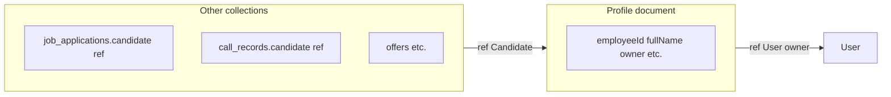

Snapshot of `candidate_field_feasibility_note_96bbc731.plan.md`; backend paths are repo-relative from the monorepo root.

# Feasibility: reusing the same fields after Candidate → Employee

## Verdict (aligned with your intuition)

**Mostly correct.** The [`candidate.model.js`](../../../uat.dharwin.backend/src/models/candidate.model.js) **schema fields** are not named with a `candidate*` prefix. They already include **`employeeId`**, `fullName`, `owner` (ref to `User`), HR/address/skills, attendance-related fields, etc. So from a **“do we need new columns for Employee?”** perspective: **no**—the same document shape can represent an “employee” record after a **model/collection** rename, without inventing a parallel field set.

What still changes in a full rename program is **not** the inner field names of that profile, but:

1. **Mongoose model name** `Candidate` → `Employee` (or keep internal name; product decision).
2. **Mongo collection** `candidates` → `employees` (if you rename at DB level) and any raw queries.
3. **`ref: 'Candidate'`** on **other** models—those break if the model is renamed without updating every ref ([`jobApplication.model.js`](../../../uat.dharwin.backend/src/models/jobApplication.model.js) has a field key **`candidate`**, [`callRecord.model.js`](../../../uat.dharwin.backend/src/models/callRecord.model.js), [`sopNotificationState.model.js`](../../../uat.dharwin.backend/src/models/sopNotificationState.model.js), [`offer.model.js`](../../../uat.dharwin.backend/src/models/offer.model.js), [`placement.model.js`](../../../uat.dharwin.backend/src/models/placement.model.js), [`supportTicket.model.js`](../../../uat.dharwin.backend/src/models/supportTicket.model.js), [`candidateGroup.model.js`](../../../uat.dharwin.backend/src/models/candidateGroup.model.js), [`assignmentRow.model.js`](../../../uat.dharwin.backend/src/models/assignmentRow.model.js), [`recruiterActivityLog.model.js`](../../../uat.dharwin.backend/src/models/recruiterActivityLog.model.js)).

Optional later cleanup: **rename subdocument field keys** from `candidate` to `employee` on those models for API consistency—**not required** for correctness if you only update `ref` and model name, but affects JSON keys and any client that hard-codes `candidate` in response shapes.

## Mermaid: where “candidate” still appears

## Implication for [.cursor/plans/ats_candidate_to_employee_rename.plan.md](../../../.cursor/plans/ats_candidate_to_employee_rename.plan.md)

- **T5 (collection/model)** remains the heavy lift: **refs + indexes + aggregations**, not redesigning the profile field list.
- **Your note** that existing fields can stay as-is is **valid** for the **core profile document**; plan updates (if you want them recorded) can add: “No new Employee-specific columns required—rename is structural (model/collection/refs).”

## Suggested follow-up (plan iteration only, not execution)

- Decide whether to **rename foreign-key field keys** from `candidate` to `employee` in other models in the same release as `ref` change, or in a follow-up to limit blast radius.
